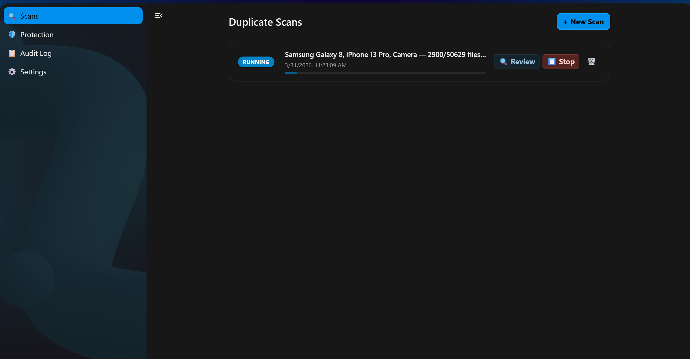

# Dupli — Duplicate Media Finder for Nextcloud

Dupli scans your Nextcloud media library and finds duplicate photos and videos using perceptual hashing.

## Features
- Perceptual hash detection (dHash, pHash, wHash)
- Bulk delete with glob filter patterns (e.g. `IMG*`)
- Folder protection rules
- Audit log with CSV export
- Inline image preview

## Requirements
- Nextcloud 25+
- Python 3 with `imagehash`, `Pillow`, `numpy`, `pymysql`

## Installation
Download the latest release zip and extract to your Nextcloud `apps/` directory, then enable via `occ app:enable urbanduplicati`.
